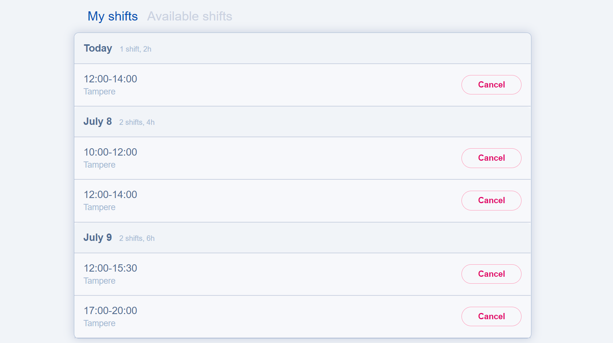

# <div align="center"> Shifts Booking

<div align="center">

This project Is bootstrapped with [Create React App](https://github.com/facebook/create-react-app) and using flexbox for UI. Backend is built with node.js on top of Hapi.js. Development enviornment is 64bit Windows 10.

</div>

<div align="center">

</div>

<p align="center"><a href="https://github.com/Rajesh-Royal/react-slot-bookee"></a><a href="#"></a></p><br/>
  

> Use node `v12.0.0` to run the hapi server, in versions `>12` the post requests and the routes configurations dosen't work. 

> Use node `v16` to run the client. First Run the client with node v16 then use nvm to switch to node v12 to run the server. Now both will run without any errors.

&nbsp;
## <p>Available Scripts :helicopter:</p>

This project usages NPM package manager and in the project directory, you can run:

### Root scripts

| Client Script            | Description                                              |
|--------------------------|----------------------------------------------------------|
| `start:client`           | Starts the development server of client                  |
| `start:server`           | Starts the development server of server                  |
| `setup:project`              | Install client and server dependencies.  |
| `create:release`         | Creates **changelog.md** file |
| `install:client`         | Install client's npm packages                              |
| `build:client`           | build client in production      env                            |
| `lint:client`           | list all the linting errors fo the client                            |
| `lint:fix:client`           | fixes all the prettier and linting errors with eslint and prettier for client                            |
| `lint:server`           | lists all the linting errors for server                            |
| `lint:fix:server`           | fixes all the prettier and linting errors with eslint and prettier for server                            |


<details>
  <summary># <b>Individual scripts</b></summary>

| Client Script      | Description                               | Server Script      | Description                         |
|--------------------|-------------------------------------------|--------------------|-------------------------------------|
| `start`            | Starts the client app                     | `start`             | Starts the hapi node server         |
| `build`            | Production build                          | `lint`              | list all the liting errors          |
|  `test`            | Runs unit tests                           | `lint:fix`          | fix all the liting errors           |
|  `eject`           | [React Eject](https://bit.ly/2TOYE0A)     
| `lint`             | Shows all the linting errors in codebase  
| `lint:fix`         | Fix all the liting errors                 

</details>

> Husky hooks will lint code in client/server folder before commiting it.

## 🧐 What's inside?

A quick look at the top-level files and directories you'll see in this project.

<details>
  <summary>Root</summary>
├── .vscode
├── .husky
├── node_modules
├── Client
    ├── node_modules
    ├── public
    ├── src
        ├── api
        ├── assets
        ├── components
        ├── config
        ├── constants
        ├── store
        ├── styles
        ├── utils
        ├── index.tsx
        ├── app.tsx
    ├── .eslintrc.json
    ├── .gitignore
    ├── .env
    ├── .huskyrc
    ├── craco.config.js
    ├── package.json
    ├── tsconfig.json
    ├── tsconfig.paths.json
    ├── README.md
    └── package.lock.json
├── Server   
    ├── node_modules
    ├── api
        ├── shifts-mock-api
        ├── index.js
        ├── README.md
        ├── server.js
    ├── .gitignore
    ├── package.json
    ├── README.md
    └── package.lock.json
├── .gitignore
├── CHANGELOG.md
├── package-lock.json
├── package.json
├── Readme.md
├── shifts_booking_preview.png
├── todo.md
</details>

> `.vscode/`: This directory contains all of the workspace setting for vscode.
> `.husky/`:  All the husky configuration.

## Build client
- Run `npm run build` in `client` folder.


### 📝Notes 

- if husky hooks not working it can be because of husky didn't created hooks shell script in `.husky` directory. To fix this run the following commands in root of this project.
- Before running hapi server make sure you have installed `babel-cli` globally with `npm i -g babel-cli`

```json
npx husky install // this will setup the husky hooks script in .husky folder
```

- <b>Client</b> application will run at port 3000 if available otherwise it will pick any available port.
- <b>Server</b> will be running at port 8080.

